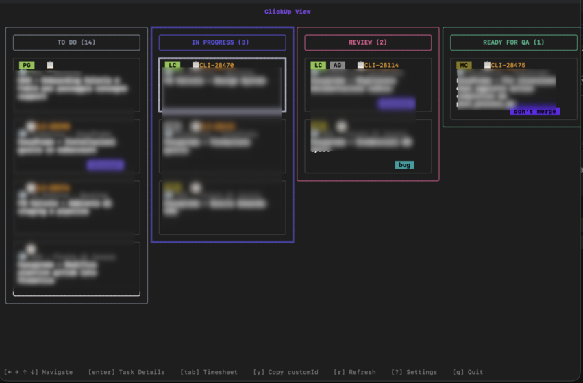

# clickup-tui

A modern terminal user interface (TUI) client for [ClickUp](https://clickup.com/), built in Go using the Charmbracelet Bubble Tea ecosystem. Manage your ClickUp tasks, track time, and configure your workspace directly from your terminal.



## Installation

### Pre-built Binaries

```sh
curl -Ssl https://raw.githubusercontent.com/mceck/clickup-tui/refs/heads/main/scripts/install.sh | sh
```

### From Source

Clone the repository and run:

```sh
go install
```

This will build and place the `clickup-tui` binary in your `$GOBIN`.

## Configuration

On first run, or by selecting the Settings view (`?`), you will be prompted to enter your ClickUp credentials:

- **ClickUp API Token** [see ClickUp API docs](https://developer.clickup.com/docs/authentication#personal-token)
- **Team ID** (you can find this in the URL when viewing your ClickUp workspace https://app.clickup.com/{team_id}/...)
- **View ID** (for the kanban board)

TODO implement a picker for team, and view IDs.

These are saved in a JSON file at:

```
$HOME/.config/clickup-tui/config.json
```

Example config:

```json
{
  "clickup_token": "your-token-here",
  "team_id": "your-team-id",
  "user_id": "your-user-id",
  "view_id": "your-view-id"
}
```

## Usage

- **Navigation:**
  - `Tab`: Switch between Home and Timesheet views
  - `?`: Open Settings view
  - `Ctrl+C` or `q`: Quit
  - `r` refresh
- **Home View:**
  - Arrow keys to move between columns and tasks
  - Enter a View ID if prompted
  - Press Enter to view task details and comments
- **Timesheet View:**
  - Arrow keys to move between tasks and days
  - Enter to edit hours

## Acknowledgements

This extension is unofficial and not affiliated with ClickUp.
